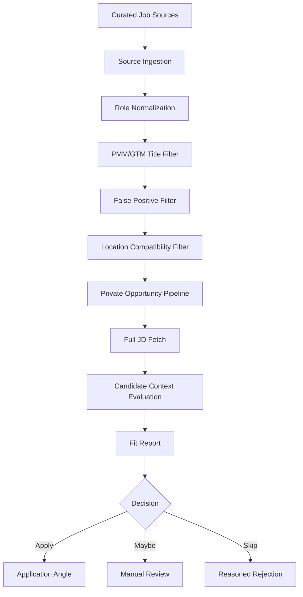
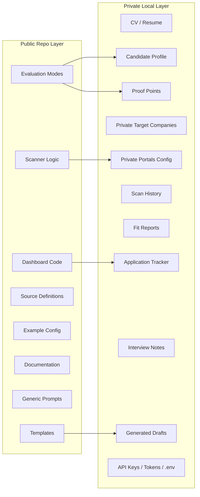
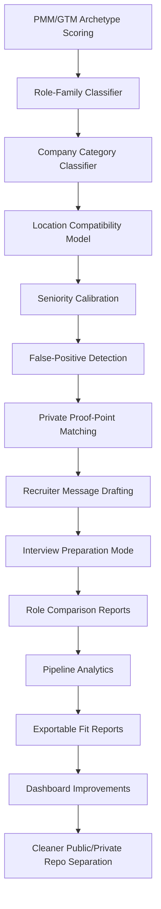

# PMM/GTM Career Intelligence Pipeline

<p align="center">
  
  
  
  
</p>

<p align="center">
  <strong>A career intelligence pipeline for Product Marketing and Go-to-Market roles.</strong><br>
  Built to filter noisy opportunities, qualify fit, and protect time before an application ever starts.
</p>

<p align="center">
  <em>Less job search. More signal qualification.</em>
</p>

---

## The Problem

AI made applying to jobs easier.

That sounds useful until the whole market becomes noisier.

Candidates can apply faster.  
Companies receive more applications.  
Job descriptions get packed with the same ambiguous words:

```text
AI
GTM
Remote
SaaS
Platform
Strategy
Growth
Product Marketing
```

The result is not clarity.

The result is noise.

Most job-search systems still work like keyword search. They find roles that contain the right words, then leave the real qualification work to the candidate.

That is the wrong layer to automate.

The hard part is no longer finding more roles.

The hard part is deciding which roles are actually worth time.

---

## The Idea

This project treats job discovery like a qualification pipeline.

Instead of asking:

```text
Which jobs match my keywords?
```

it asks:

```text
Is this actually a PMM/GTM role?
Is the location model real?
Is it senior enough?
Is the function strategic enough?
Do I have evidence for this role?
Should this move forward, wait, or be skipped?
```

The useful output is not:

```text
Here are 50 more jobs.
```

The useful output is:

```text
This role looked relevant by title, but it is not worth your time.
```

That is the product idea.

A career workflow should not simply increase application volume.

It should improve decision quality.

---

## Positioning

**PMM/GTM Career Intelligence Pipeline** is a private, configurable operating system for role qualification.

It is designed for Product Marketing and Go-to-Market professionals who want to separate real opportunities from noisy listings before investing time in applications, CV tailoring, recruiter outreach, or interview preparation.

It helps answer:

| Question | Why it matters |
|---|---|
| Is this actually PMM/GTM? | Many “GTM” roles are RevOps, sales ops, systems, finance, or field operations. |
| Is the role location-compatible? | “Remote” can mean global, EMEA, Europe-only, US-only, or hybrid. |
| Is the role senior enough? | Title inflation and vague levels waste time. |
| Is the role strategic or execution-heavy? | Some “PMM” roles are mostly content production. |
| Is there real evidence for fit? | Applications are stronger when grounded in proof points, not generic claims. |
| Should this be apply, maybe, or skip? | A clear skip is often more valuable than another weak lead. |

---

## One-Line Value Proposition

> **A signal qualification layer for PMM/GTM job discovery.**

---

## What This Is Not

This is not a mass-apply bot.

It does not submit applications automatically.  
It does not spam recruiters.  
It does not invent experience.  
It does not optimize for “more applications sent.”  

The system is designed to keep the human in control.

It improves the quality of the decision before the human acts.

---

## How It Works



The pipeline starts with curated sources: company career pages, ATS pages, job boards, and manually added job descriptions.

It then filters for PMM/GTM relevance, removes common false positives, checks location compatibility, and evaluates the full job description against a private candidate context layer.

The output is a structured recommendation.

Not a generic summary.

---

## The Marketing View

Think of the system as a funnel.


Most job tools optimize the top of the funnel.

This one optimizes the middle.

It is not built to maximize the number of roles seen.

It is built to reduce the number of bad decisions.

---

## Why PMM/GTM Needs This

Product Marketing and Go-to-Market roles are unusually noisy because the titles overlap with many other functions.

“GTM” can mean:

- Product Marketing
- RevOps
- Sales Operations
- GTM Systems
- Strategic Finance
- Field Marketing
- Growth
- Sales Enablement
- Revenue Strategy
- Partnerships
- Business Operations

“Product Marketing” can mean:

- Positioning and messaging
- Launch strategy
- Competitive intelligence
- Sales enablement
- Technical narrative
- Market research
- Content production
- Demand generation support
- Customer marketing
- Partner marketing

A generic job-search workflow cannot reliably tell the difference.

This pipeline is built around those distinctions.

---

## Target Users

This adaptation is designed for people working around:

- Product Marketing
- Technical Product Marketing
- Platform Marketing
- AI Product Marketing
- Go-to-Market Strategy
- Sales Enablement
- Competitive Intelligence
- Partner Marketing
- Marketplace Marketing
- Vertical / Industry Marketing
- B2B SaaS and enterprise software GTM

The strongest use case is a senior candidate who does not need “more jobs,” but needs a better way to sort signal from noise.

---

## Target Role Families

| Core PMM/GTM Roles | Adjacent Roles Worth Reviewing |
|---|---|
| Product Marketing Manager | Sales Enablement Manager |
| Senior Product Marketing Manager | Revenue Enablement Manager |
| Principal Product Marketing Manager | Competitive Intelligence Manager |
| Director of Product Marketing | Market Intelligence Manager |
| Head of Product Marketing | Partner Marketing Manager |
| Technical Product Marketing Manager | Marketplace Marketing Manager |
| Platform Product Marketing Manager | Vertical Marketing Manager |
| AI Product Marketing Manager | Industry Marketing Manager |
| GTM Manager | Solutions Marketing Manager |
| Go-to-Market Manager | Product Launch Manager |

The system can evaluate adjacent roles, but it should remain strict about whether the work is truly close to PMM/GTM.

---

## False Positives It Is Designed to Catch

A large part of the value is rejecting roles that contain the right words but represent the wrong function.

| Looks relevant because... | But may actually be... |
|---|---|
| “GTM” | RevOps, sales ops, GTM systems, strategic finance |
| “Growth” | Paid media, lifecycle, CRM, demand generation |
| “Platform” | Engineering, developer relations, infrastructure |
| “AI” | Generic SaaS with AI messaging added later |
| “Enablement” | Sales training, onboarding, documentation-only work |
| “Product Marketing” | Content production with a PMM title |

Common downgrade or reject categories:

- GTM Engineer
- GTM Systems
- Strategic Finance
- RevOps
- Sales Operations
- SDR / BDR / AE
- Recruiting / Talent Acquisition
- Content-only marketing
- Social media marketing
- Brand-only marketing
- Event coordination
- Customer Success
- Implementation
- Project Management
- Developer Advocate / DevRel
- Software Engineering
- Junior or intern roles
- Pure demand generation
- Paid media
- SEO-only roles
- CRM/lifecycle-only roles

These are not bad jobs.

They are simply not the target jobs.

---

## Location Qualification

Location is treated as a core qualification layer, not a detail.

The pipeline is tuned for roles compatible with:

```text
Europe
EMEA
CET
GMT
UK
Ireland
Germany
Netherlands
France
Spain
Portugal
Italy
Romania
Poland
Czech Republic
Nordics
DACH
Benelux
EU
Remote Europe
Remote EMEA
Global remote
±2 hours CET
```

The system should distinguish between:

| Location phrase | Interpretation needed |
|---|---|
| Remote | Remote where? |
| Remote Europe | Likely compatible |
| Remote EMEA | Likely compatible |
| Remote US | Usually not compatible |
| Hybrid | Requires city-level review |
| Flexible | Often means office-first |
| Global remote | Strong positive signal |
| Work authorization required | Needs manual review |

A job can pass the title filter and still fail because the location model is wrong.

That is expected behavior.

---

## Evaluation Layer

The evaluation should behave less like a summarizer and more like a PMM/GTM reviewer.

A useful evaluation answers:

- What is the real function of this role?
- Is it actually PMM/GTM?
- Is it closer to product marketing, sales enablement, partner marketing, field marketing, growth, or operations?
- Is the company category relevant?
- Is the role senior enough?
- Is it strategic or mostly executional?
- Does the JD require technical fluency?
- Does it require vertical expertise?
- Does it require platform, ecosystem, marketplace, AI, or enterprise SaaS experience?
- Is there evidence in the candidate profile to support the match?
- What proof points should be used?
- What are the risk flags?
- What is missing?
- Should the role be apply, maybe, or skip?

The output should be a decision aid.

Not a motivational paragraph.

---

## Recommended Report Format

```yaml
role_title:
company:
source_url:
location_model:
role_family:
seniority:
company_category:
function_fit:
location_fit:
evidence_match:
risk_flags:
missing_proof:
fit_score:
recommendation:
application_angle:
recruiter_message_angle:
interview_prep_notes:
next_action:
```

Decision values:

```text
apply
maybe
skip
```

A good `skip` is a valid success state.

---

## Example Recommendations

### Apply

```yaml
recommendation: apply
reason: >
  The role is a clear PMM/GTM fit, location-compatible, senior enough,
  and strongly supported by existing proof points. The JD emphasizes
  positioning, launches, enablement, competitive intelligence, and
  enterprise SaaS GTM.
```

### Maybe

```yaml
recommendation: maybe
reason: >
  The role is adjacent to PMM but may lean toward field marketing or
  revenue marketing. Location appears compatible, but the responsibilities
  require manual review before investing time.
```

### Skip

```yaml
recommendation: skip
reason: >
  The title contains GTM, but the role is functionally RevOps.
  Responsibilities focus on CRM architecture, revenue process,
  pipeline operations, and sales systems rather than positioning,
  launches, enablement, or product narrative.
```

---

## Scoring Philosophy

The pipeline optimizes for rejection quality.

A role should not move forward only because it contains the right keywords.

It should move forward because the title, company context, location model, seniority, responsibilities, and candidate evidence create a credible match.

| Dimension | What it checks |
|---|---|
| `role_relevance` | Is this actually PMM/GTM? |
| `location_compatibility` | Can the candidate realistically work this role? |
| `seniority_match` | Is the level aligned? |
| `company_category_fit` | Is the company category relevant? |
| `technical_pmm_fit` | Does the role need technical product fluency? |
| `gtm_scope` | Is the scope strategic enough? |
| `evidence_strength` | Is there proof behind the fit? |
| `risk_level` | What could make this a bad use of time? |
| `application_effort` | How expensive is the application motion? |
| `expected_upside` | Is the upside worth the effort? |

The score is not truth.

It is a forcing function for better judgment.

---

## Architecture

The system separates reusable workflow logic from private candidate data.



The reusable system can be public.

The candidate evidence layer should remain private.

---

## Public / Private Boundary

### Good Public Content

- workflow logic
- generic PMM/GTM filtering rules
- example configuration
- fake example reports
- generic templates
- scanner architecture
- documentation
- privacy model
- setup instructions

### Private Content That Should Not Be Committed

- real CV
- real resume
- personal profile
- proof points
- scan history
- fit reports
- real application tracker
- generated application drafts
- recruiter messages
- private target lists
- personal career strategy
- saved job descriptions for private evaluation
- interview preparation notes
- credentials
- API keys
- tokens
- `.env` files

Before making the repository public, inspect both the working tree and Git history.

Removing a private file from the latest commit is not enough if it already exists in previous commits.

---

## Suggested `.gitignore`

```gitignore
# Private candidate data
cv.md
resume.md
*.resume.pdf
*Resume*
*CV*

# Private profile and proof points
config/profile.yml
config/private*.yml
profile.yml
proof-points.md
article-digest.md

# Private source configuration
portals.yml
private-portals.yml
target-companies.yml

# Runtime data
data/
reports/
output/
jds/
interview-prep/
applications/
scan-history/

# Generated drafts
drafts/
cover-letters/
recruiter-messages/

# Environment and secrets
.env
.env.*
*.key
*.pem
*.token
secrets.*
```

Verify what Git is tracking:

```bash
git status
git ls-files | grep -Ei "resume|cv|profile|proof|application|report|token|secret|env|key|jd|interview|pipeline|draft"
```

If sensitive files appear in `git ls-files`, remove them from tracking:

```bash
git rm --cached path/to/private-file
```

If sensitive files were committed historically, clean Git history before making the repo public.

---

## Capabilities

- Config-driven job source scanning
- Company career page ingestion
- Job board ingestion
- ATS source parsing
- PMM/GTM title filtering
- Adjacent title expansion
- Negative keyword filtering
- False-positive rejection
- Location compatibility filtering
- Company category tagging
- Full job description fetching
- Candidate-profile-based evaluation
- Fit scoring
- Recommendation reports
- Local opportunity tracking
- Dry-run mode for testing
- Dashboard or tracker view
- Human-reviewed application material generation
- Public workflow logic separated from private data

---

## Source Categories

| Category | Why it matters |
|---|---|
| AI-native / LLM / agentic AI | Strong fit for AI PMM, platform PMM, technical narrative |
| Developer tools and infrastructure | Useful for technical PMM and platform positioning |
| Enterprise SaaS | Core PMM, launch, enablement, competitive intelligence |
| CRM / RevTech / Sales technology | GTM, sales enablement, buyer journey, revenue tooling |
| Automation and workflow orchestration | Strong fit for AI agents, RPA, orchestration, process automation |
| Data, analytics, BI, and MLOps | Technical narrative, data products, platform GTM |
| Cybersecurity and identity | Enterprise buyers, trust narratives, risk positioning |
| Fintech infrastructure | Regulated software, B2B platform GTM |
| Vertical SaaS | Industry-specific positioning and segment GTM |
| Marketplaces and platform businesses | Ecosystem strategy, supply/demand dynamics, marketplace GTM |
| Collaboration and productivity | Adoption, PLG, workflow narratives |
| Contact center and CX software | Automation, voice AI, conversational AI, service operations |

The point is not to scan the whole internet.

The point is to scan a curated universe where relevant PMM/GTM roles are more likely to appear.

---

## Example Filtering Logic

A role may enter the pipeline if it contains strong target signals:

```text
Product Marketing Manager
Senior Product Marketing Manager
Technical Product Marketing
Platform Product Marketing
AI Product Marketing
Partner Marketing
Marketplace Marketing
Competitive Intelligence
Sales Enablement
GTM Manager
Go-to-Market Manager
Product Launch
Solutions Marketing
Vertical Marketing
Industry Marketing
```

A role may be rejected or downgraded if it contains strong negative signals:

```text
SDR
BDR
Account Executive
RevOps
Sales Operations
Strategic Finance
GTM Systems
Engineer
Developer Advocate
DevRel
Recruiter
Content Writer
Social Media
Event Coordinator
Customer Success
Implementation
Project Manager
Intern
Junior
```

### Example: Reject

```yaml
title: GTM Manager
description: Owns pricing models, revenue forecasting, CRM architecture, and sales territory planning.
decision: likely RevOps / GTM Ops, not PMM
```

### Example: Accept

```yaml
title: Product Marketing Manager
description: Owns positioning, launches, sales enablement, competitive intelligence, and platform narrative.
decision: strong PMM fit
```

---

## Human-in-the-Loop Rules

### The system should not:

- auto-submit job applications
- auto-send recruiter messages
- auto-fill final application forms without review
- invent candidate experience
- exaggerate proof points
- bypass job board or ATS terms
- spam employers
- optimize for application volume

### The system should:

- summarize roles
- identify fit and mismatch
- surface proof points
- draft materials for review
- recommend next actions
- maintain a clear pipeline
- make skip decisions explicit

---

## Setup

Install dependencies:

```bash
npm install
```

Install browser dependencies if PDF generation, browser verification, or Playwright-based flows are used:

```bash
npx playwright install chromium
```

Copy example configuration files:

```bash
cp config/profile.example.yml config/profile.yml
cp templates/portals.example.yml portals.yml
```

Customize local private files as needed.

Do not commit private candidate data.

---

## Running a Scan

Run the scanner:

```bash
npm run scan
```

or directly:

```bash
node scan.mjs
```

Use dry-run or verification options when available:

```bash
node scan.mjs --dry-run
node scan.mjs --verify
```

A good scan is not necessarily one that returns the most roles.

A good scan returns fewer weak matches and more credible candidates for evaluation.

---

## Evaluating a Role

Evaluate a role by pasting a job URL or full job description into the supported AI coding CLI and asking it to run the PMM/GTM career evaluation workflow.

```text
Evaluate this PMM/GTM role:

[paste job description or URL]
```

The output should be a structured recommendation, not a generic summary.

A strong evaluation should include:

```text
role summary
function classification
location compatibility
seniority match
evidence match
risks
missing proof
fit score
apply / maybe / skip recommendation
application angle
next action
```

---

## Dashboard / Tracker

The local tracker should help answer:

- What roles are new?
- What roles are pending evaluation?
- What roles were skipped?
- Why were they skipped?
- Which roles are worth applying to?
- Which applications are in progress?
- Which roles need follow-up?
- Which companies keep producing relevant opportunities?
- Which sources generate noise?

The tracker should make the pipeline easier to reason about, not just larger.

---

## Roadmap



Possible improvements:

- Stronger PMM/GTM archetype scoring
- Role-family classifier
- Company category classifier
- Better location compatibility model
- Seniority calibration
- False-positive detection improvements
- Private proof-point matching
- Recruiter message drafting
- Interview preparation mode
- Role comparison reports
- Pipeline analytics
- Current month vs previous month reporting
- Exportable fit reports
- Dashboard improvements
- Cleaner public/private repo separation
- Safer onboarding flow for private candidate data

---

## Technical Positioning

This project is best understood as a small operating system for career qualification.

It combines:

```text
source ingestion
filtering logic
candidate context
role evaluation
fit scoring
pipeline tracking
human review
```

The technical point is not automation for its own sake.

The technical point is structured judgment.

```text
Volume is cheap.
Signal quality is not.
```

---

## Suggested Hero Image

For a public GitHub README, avoid generic “AI robot” visuals.

A better visual direction would be a simple product-style architecture diagram:

```text
Noisy job market
    ↓
PMM/GTM qualification engine
    ↓
Apply / Maybe / Skip
```

This can be added later as:

```markdown
<p align="center">
  
</p>
```

Keep the image inside the repo under `docs/` so the README stays stable.

---

## Attribution

This repository is adapted from the original Career-Ops project by Santiago.

Original project: `santifer/career-ops`

This fork changes the positioning and configuration toward PMM/GTM role qualification, signal filtering, location compatibility, false-positive rejection, and private candidate-context evaluation.

Please review and preserve the applicable upstream license and trademark requirements before redistributing or presenting this fork publicly.

---

## License

Based on the upstream Career-Ops project.

See the repository license for terms.
